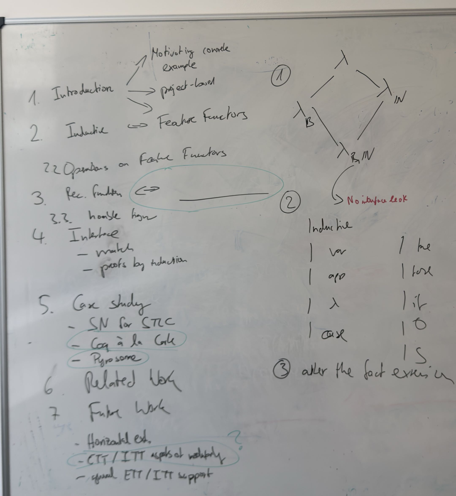

Made a more concrete plan for the future of the internship, and the report's writing:

General skeleton is in the image.
Things to focus on for now: 
- finish feature functors for inductives **quickly**
- focus on def feature functors
- Once done, look into doing some case study resembling Coq à la Carte's
- Look into a Pyrosome case-study and show how easy it was to reproduce it

IF YOU HAVE ENOUGH TIME:
- Look into the ETT/ITT translation thing so that one may modmap a def to something that doesn't reduce to the exact same thing (like the LR in the STLC extension), and translate any term containing that def to one that does **not** rely on its delta-reduction behaviour. That way, modmapping it will be easy as 1-2-3.

Also: Read Derek Dreyer's "HOW TO WRITE PAPERS SO PEOPLE CAN READ THEM"